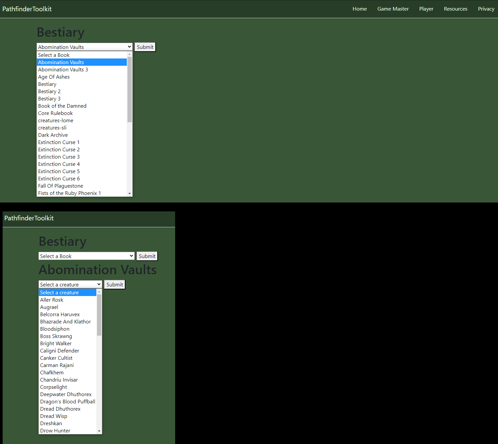

# PathfinderToolkit
This is a web application for Gamemasters and Players of Pathfinder 2e.

## Overview

The application currently provides a resource page for Gamemasters and Players, with plans to include an encounter tracker, a player stat and inventory tracker, and a dice roller for use in-game.

## Technologies Used

The application is built using ASP.NET MVC and uses the Newtonsoft library for working with JSON databases.

## Installation

1. Clone this repository to your local machine.
2. Open the solution in Visual Studio.
3. Build and run the application.

## Usage

To use the application, simply navigate to the resource page and browse the available resources.

## Contributing

To contribute to this project, please fork the repository and submit a pull request.

